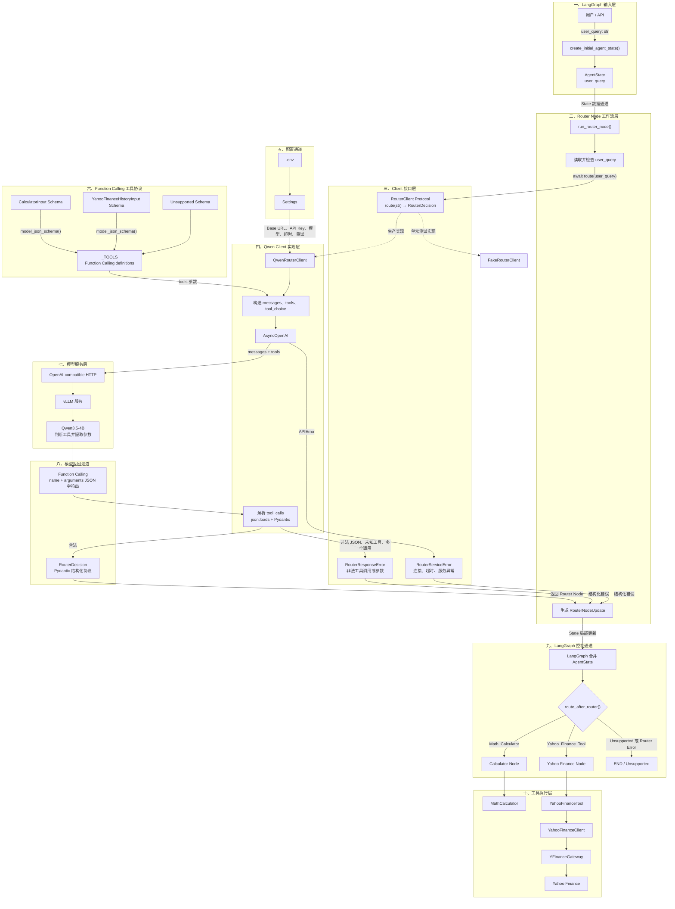

```mermaid
flowchart TD
    subgraph ENTRY["一、LangGraph 输入层"]
        USER["用户 / API"]
        INIT["create_initial_agent_state()"]
        STATE_IN["AgentState<br/>user_query"]
        USER -->|"user_query: str"| INIT
        INIT --> STATE_IN
    end

    subgraph ROUTER_NODE["二、Router Node 工作流层"]
        RN["run_router_node()"]
        READ["读取并检查 user_query"]
        WRITE["生成 RouterNodeUpdate"]
        RN --> READ
    end

    STATE_IN -->|"State 数据通道"| RN

    subgraph CLIENT_PROTOCOL["三、Client 接口层"]
        RC["RouterClient Protocol<br/>route(str) → RouterDecision"]
        RSE["RouterServiceError<br/>连接、超时、服务异常"]
        RRE["RouterResponseError<br/>非法工具调用或参数"]
    end

    READ -->|"await route(user_query)"| RC

    subgraph QWEN_CLIENT["四、Qwen Client 实现层"]
        QRC["QwenRouterClient"]
        BUILD["构造 messages、tools、tool_choice"]
        SDK["AsyncOpenAI"]
        PARSE["解析 tool_calls<br/>json.loads + Pydantic"]
        QRC --> BUILD
        BUILD --> SDK
    end

    RC -.->|"生产实现"| QRC
    RC -.->|"单元测试实现"| FAKE["FakeRouterClient"]

    subgraph CONFIG["五、配置通道"]
        ENV[".env"]
        SETTINGS["Settings"]
        ENV --> SETTINGS
    end

    SETTINGS -->|"Base URL、API Key、模型、超时、重试"| QRC

    subgraph TOOL_PROTOCOL["六、Function Calling 工具协议"]
        CALC_SCHEMA["CalculatorInput Schema"]
        YAHOO_SCHEMA["YahooFinanceHistoryInput Schema"]
        UNSUPPORTED_SCHEMA["Unsupported Schema"]
        TOOLS["_TOOLS<br/>Function Calling definitions"]

        CALC_SCHEMA -->|"model_json_schema()"| TOOLS
        YAHOO_SCHEMA -->|"model_json_schema()"| TOOLS
        UNSUPPORTED_SCHEMA --> TOOLS
    end

    TOOLS -->|"tools 参数"| BUILD

    subgraph MODEL_SERVICE["七、模型服务层"]
        HTTP["OpenAI-compatible HTTP"]
        VLLM["vLLM 服务"]
        QWEN["Qwen3.5-4B<br/>判断工具并提取参数"]
        HTTP --> VLLM
        VLLM --> QWEN
    end

    SDK -->|"messages + tools"| HTTP

    subgraph RESPONSE["八、模型返回通道"]
        TOOL_CALL["Function Calling<br/>name + arguments JSON 字符串"]
        DECISION["RouterDecision<br/>Pydantic 结构化协议"]
    end

    QWEN --> TOOL_CALL
    TOOL_CALL --> PARSE
    PARSE -->|"合法"| DECISION
    PARSE -->|"非法 JSON、未知工具、多个调用"| RRE
    SDK -->|"APIError"| RSE

    DECISION -->|"返回 Router Node"| WRITE
    RSE -->|"结构化错误"| WRITE
    RRE -->|"结构化错误"| WRITE

    subgraph GRAPH_ROUTE["九、LangGraph 控制通道"]
        MERGE["LangGraph 合并 AgentState"]
        EDGE{"route_after_router()"}
        CALC_NODE["Calculator Node"]
        YAHOO_NODE["Yahoo Finance Node"]
        END_NODE["END / Unsupported"]

        MERGE --> EDGE
        EDGE -->|"Math_Calculator"| CALC_NODE
        EDGE -->|"Yahoo_Finance_Tool"| YAHOO_NODE
        EDGE -->|"Unsupported 或 Router Error"| END_NODE
    end

    WRITE -->|"State 局部更新"| MERGE

    subgraph EXECUTION["十、工具执行层"]
        MATH["MathCalculator"]
        YTOOL["YahooFinanceTool"]
        YCLIENT["YahooFinanceClient"]
        YGATEWAY["YFinanceGateway"]
        YAPI["Yahoo Finance"]

        CALC_NODE --> MATH
        YAHOO_NODE --> YTOOL
        YTOOL --> YCLIENT
        YCLIENT --> YGATEWAY
        YGATEWAY --> YAPI
    end
```